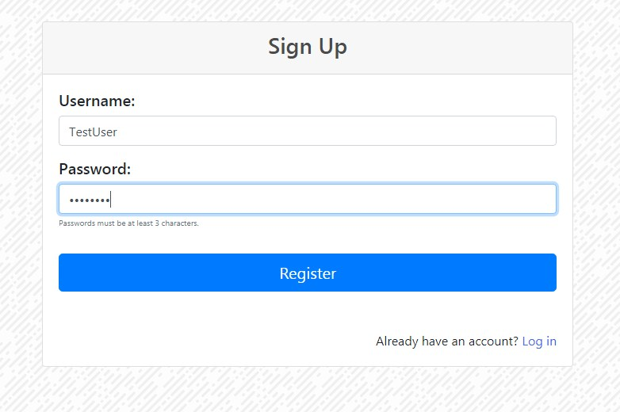

# Contract managment
This is my spring based web RESTful application with Angular Client. I used spring security and JWT authentication to allow users to login and register. After successful login user can do all CRUD operations.


## Technology stack:
* Spring (Boot, Security, Data JPA)
* Hibernate
* PostgreSQL
* JWT
* Angular
* Maven
* Junit
* HTML5, CSS
* Bootstrap
* Git (hosted on GitHub)

## About
All configuration is Java-based, there is no xml file except pom

There are three endpoints:
```
/users/sign-up - unrestricted access for adding user credentials to database
/login - after providing correct credentials, we receive Token in response header
/contracts/** - endpoint that is restricted to authorized users (a valid JWT token must be present in the request header)
```

Before adding credentials to databse user password is encoded with [bcrypt](https://en.wikipedia.org/wiki/Bcrypt)

I used hibernate to connect and map to PostgreSQL database

Client is secured with Routes to redirect to login page if someone is unauthenticated

### Some screens from client
<p align="center">
  
  
</p>
